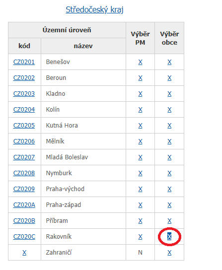

# Election Scraper

Třetí projekt Python akademiie od Engeta

## Popis projektu

Tento projekt slouží k extrahování výsledků parlamentních voleb v ČR v roce 2017. Odkaz na [výsledky](https://www.volby.cz/pls/ps2017nss/ps3?xjazyk=CZ). Výsledky jsou vyextrahovány do csv souboru.

## Instalace knihoven

Knihovny a jejich správné verze, které jsou použity v kódu, jsou uložené v souboru `requirements.txt`. Pro instalaci je doporučeno použít nové virtuální prostředí a s nainstalovaným manažerem spustit následovně:

```bash
$ pip --version #ověření verze manageru
$ pip install -r requirements.txt #instalace použitých knihoven
```

## Spuštění projektu

Soubor elections_scraper.py se spouští v rámci příkazové řádky. Pro spuštění je nutné zadat dva povinné argumenty:

```
python election_scraper.py <odkaz_uzemniho_celku> <vysledny_soubor>
<odkaz_uzemniho_celku> - je nutné zvolit url z části pro výběr obce
<vysledny_soubor> - je nutné zvolit soubor s příponou .csv
```

Po spuštění dojde ke stažení dat ze zvoleného odkazu do souboru csv se zvoleným názvem.
Projekt neumožňuje extrahovat výsledky voleb v zahraničí.

## Ukázka projektu

Výsledky hlasování pro okres Rakovník

Výběr správného odkazu:


Zadávané argumenty:

```
1.  argument: https://www.volby.cz/pls/ps2017nss/ps32?xjazyk=CZ&xkraj=2&xnumnuts=2112
2.  argument: vysledky_rakovnik.csv
```

Průběh stahování:

```
Stahuji data z vybraneho url: https://volby.cz/pls/ps2017nss/ps32?xjazyk=CZ&xkraj=2&xnumnuts=2112
Zapisuji data do souboru: vysledky_rakovnik.csv
Ukončuji election_scraper.py
```

Částečný výstup:

```
code;location;registered;envelopes;valid;Občanská demokratická strana;Řád národa - Vlastenecká unie....
565423;Bdín;51;34;34;1;0;0;7;0;1;1;1;0;0;0;0;3;0;0;1;15;0;0;0;0;0;0;0;4;0
541672;Branov;170;120;119;10;1;0;14;0;0;23;0;1;1;0;0;13;0;0;2;40;0;0;5;0;1;0;0;7;1
```
